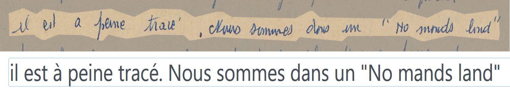
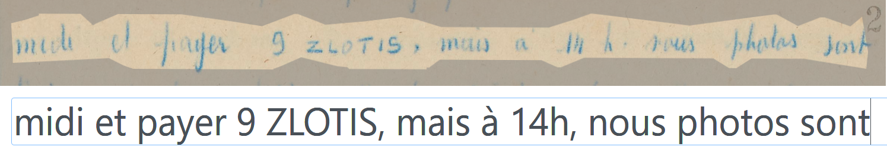
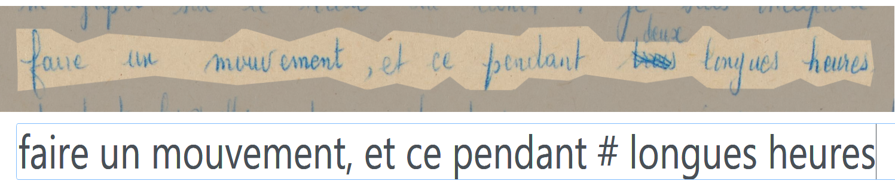
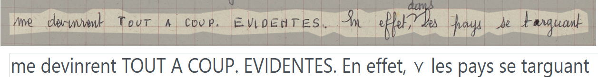
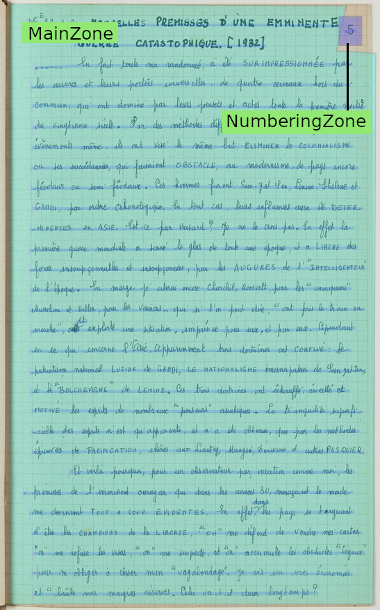
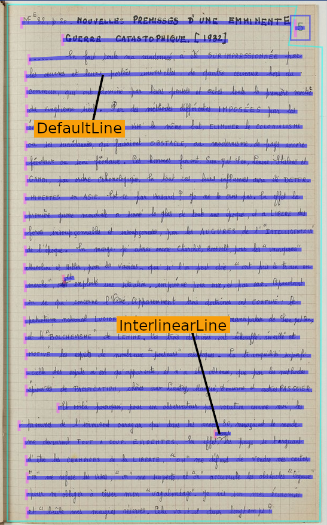

Peraire Ground Truth
=====================

[](https://zenodo.org/badge/latestdoi/523701721)

    

## License

This dataset and model are published under the CC-BY 4.0 License.

To cite this dataset:

```
Chagué, A., & Pérez, G. (2023). Peraire Ground Truth (Version 2.0.0) [Data set]. https://doi.org/10.5281/zenodo.7185907
```

## Description

This dataset was created in order to produce an HTR model for the Digital Peraire project. The documents are handwritten, dating from the second half of the 20th century, written in French with a blue ink pen or, more frequently, with a blue pencil. Occasional marginal notes appear in red. 

## Transcription guidelines

The transcription respects what is written on the document, including ponctuation and spelling errors. 



The case is respected: capital letters are transcribed with capital letters.



Crossed out words are signaled by `#` which isn't used to transcribe anything else.



When a "v"-like sign is used to signal an insertion, it is transcribed with the character `⋎`.



## Segmentation guidelines

The SegmOnto ontology was used for the segmentation of this dataset. 

For regions, `MainZone` and `MarginTextZone` were used. For lines, `DefaultLine` and `InterlinearLine` were used. 

| Regions | Lines |
| :-----: | :---: |
|  |  |

**Warning:** Since the main goal of this dataset was to produce ground truth for the transcription phase, and given how faded the text is on some pages, it is not recomended to use the following images to train a segmentation model:

- B.1.intro-eurasie_0005.jpg
- B.1b.europe-centrale_0005.jpg
- B.2.europe-orientale_0007.jpg 
- B.26.malais_0048.jpg
- B.28.java2_0017.jpg

## Sources

The original documents are held at the Bibliothèque Sébert, Espéranto-France, Paris. They should be mentionned every time the images are used. 

## Model

See the [models' README](https://github.com/alix-tz/peraire-ground-truth/blob/master/models/readme.md) for more information about the training of the model. 

<!--

## Trainset preparation

With Kraken 4.1.2.

```
ketos compile --random-split 0.8 0.1 0.1 -f xml -o train.arrow $PWD/../data/train/*.xml
```

-->